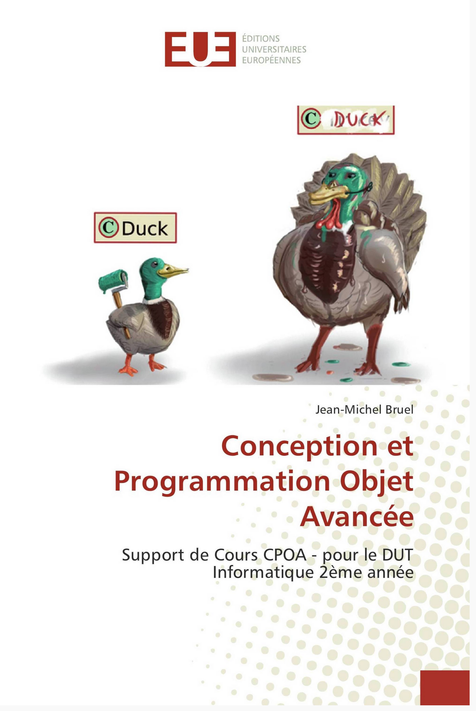

= Conception et Programmation Objet Avancée (M3105)
Jean-Michel Bruel <jbruel@gmail.com>
v1.1, {localdate}: First draft

//---------------- Définitions
:m3105: http://webetud2.iut-blagnac.fr/course/view.php?id=30[M3105]
:eue: https://www.editions-ue.com[Éditions  Universitaires Européennes]
//------------------------------

== Contexte

Ce site regroupe le matériel pédagogique de module {M3105} de
deuxième année du DUT Informatique de l'IUT de Blagnac.

Pour tout renseignement ou commentaire, contactez mailto:jbruel@gmail.com[Jean-Michel Bruel].

//Pour les résultats de ce projet, cf. http://jmbruel.github.io/cpoa/.

== Principes

Dans ce module, les cours/TD/TP s'enchaine d'une manière particulière :

Semaine N::
On examine un problème en TD et on ébauche les solutions de manière guidée, mais
en favorisant la réflexion et l'émergeance naturelle de la solution.
On ne dévoile pas tout de suite le pattern, on l'obtient seulement à la fin.

Semaine N+1::
On immplémente en TP le pattern solution, pour se frotter aux problèmes concrets d'implémentations.

Semaine N+2::
On étudie en profondeur le patron en question (ses principes, ses implémentations
  dans d'autres langages, ses limitations, etc.) et on discute des difficultés rencontrées.

NOTE: le cours peut avoir lieu en semaine N+1 si tous les TPs ont eu lieu.

== News!

Un livre papier est disponible aux {eue} (ISBN ISBN 978-3-639-54613-2).
N'hésitez pas à l'acheter si vous en avez les moyens.

== Liste des TD/TP 2017/2018

=== Strategy

TD1 (#45) et TP1 (#46)

=== Singleton

TD2 (#46) et TP2-Dojo (#47)

=== Factory

TD3 (#47) et TP3 (#48)

=== Révisions UML

TD4 (#48) et TP4-Objectivez (#49)

=== Observer

TD5 (#49) et TP5 (#50)